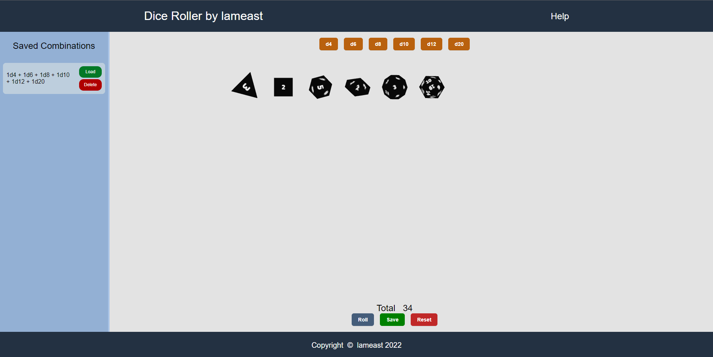

# Getting Started with Create React App

This project was bootstrapped with [Create React App](https://github.com/facebook/create-react-app).

## Available Scripts

In the project directory, you can run:

### `npm start`

Runs the app in the development mode.\
Open [http://localhost:3000](http://localhost:3000) to view it in your browser.

The page will reload when you make changes.\
You may also see any lint errors in the console.

### `npm install`

Installs all dependencies required. The required dependencies can be viewed in the package.json file.

# Dice Roller App

An app for rolling the usual dice found in tabletop games. Dice combinations can be saved and loaded.\
A live demo can be found at [https://lameast.github.io/dice-roll-app/](https://lameast.github.io/dice-roll-app/).